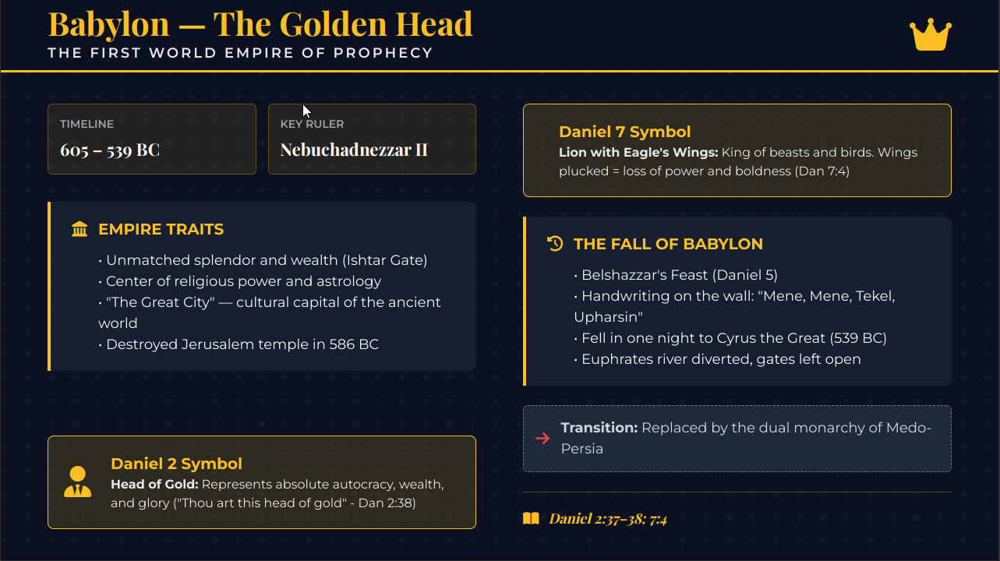
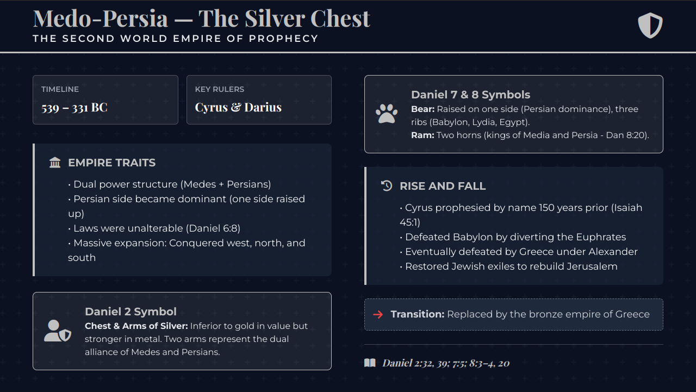
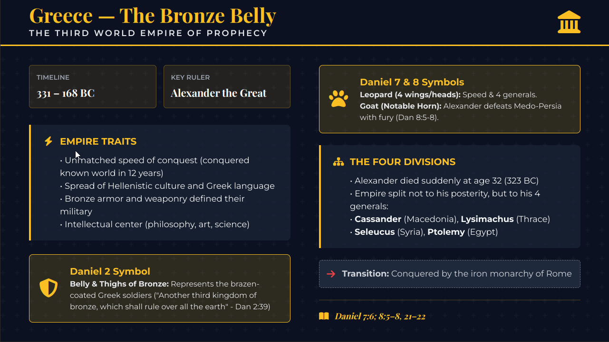
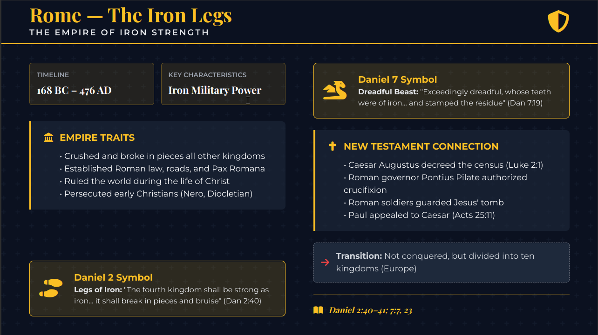
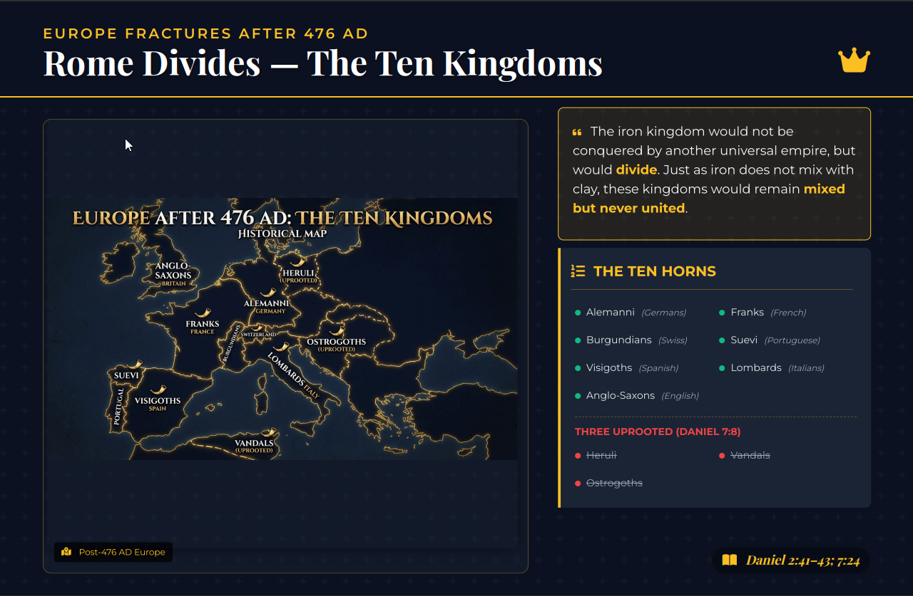

# Daniel 2: The Prophecy of the Kingdoms
## A Complete Bible Study Guide

**Using the Bible and the Bible Alone**

---

## Introduction: Why This Prophecy Matters

Daniel 2 contains one of the most remarkable prophecies in all of Scripture. Written approximately **603 BCE**, it predicted the rise and fall of world empires with stunning accuracy—**over 2,600 years of history foretold in a single dream**.

**Why study this prophecy?**

1. **Builds faith** - When we see prophecy fulfilled exactly as predicted, we know God's Word is true
2. **Confirms biblical authority** - If Daniel accurately predicted history, we can trust what he says about the future
3. **Reveals we're living in the final moments** - The prophecy shows we're in the last kingdom before Christ returns
4. **Exposes human interpretation** - God alone interprets His prophecies; no private interpretation allowed

**Key Principle**: We will use **only the Bible** to interpret this prophecy. Scripture interprets Scripture. No human wisdom, no traditions—just God's Word.

> **Note on Companion Guides**: Daniel 2 gives us the *framework* of world empires through a metallic image. **Daniel 7 & 8** present the *same kingdoms* again — this time as four beasts — adding critical details about the little horn power and the heavenly judgment. Study them together for the fullest picture.

---

## Part 1: Foundation - The Authority of Scripture

Before examining the prophecy itself, we must establish **whose word we're trusting**. Is the Bible truly reliable? Can prophecy be trusted?

### The Bible Is Inspired by God

> **2 Timothy 3:16** - "All Scripture is given by inspiration of God, and is profitable for doctrine, for reproof, for correction, for instruction in righteousness"

**What this means**: Every word of Scripture comes from God Himself. When we read the Bible, we're not reading human opinions—we're reading God's revelation to humanity.

> **2 Peter 1:21** - "for prophecy never came by the will of man, but holy men of God spoke as they were moved by the Holy Spirit."

**Key point**: The prophets didn't make up these visions. The Holy Spirit moved them to write exactly what God wanted revealed.

---

### God's Word Is Absolutely True

> **Psalms 119:160** - "Thy word is true from the beginning: and every one of Thy righteous judgments endureth for ever."

**What this means**: God's Word has been true since the beginning (Genesis 1:1) and will remain true forever. It doesn't change with culture, time, or human opinion.

> **Psalms 12:6** - "The words of the LORD are pure words: as silver tried in a furnace of earth, purified seven times."

**Illustration**: Just as silver refined seven times is completely pure with no impurities, God's Word is **perfectly pure**—no errors, no contradictions, no falsehood.

---

### God's Prophecies Always Come to Pass

> **Isaiah 14:24** - "The LORD of hosts hath sworn, saying, Surely as I have thought, so shall it come to pass; and as I have purposed, so shall it stand"

**Key principle**: What God says **will** happen. His purposes cannot be stopped by human power.

> **Isaiah 55:11** - "So shall My word be that goeth forth out of My mouth: it shall not return unto Me void, but it shall accomplish that which I please, and it shall prosper in the thing whereto I sent it."

**What this means**: God's Word **always accomplishes its purpose**. When God speaks a prophecy, it **will** be fulfilled exactly as He said.

---

### Only God Knows the Future

> **Isaiah 46:9-10** - "Remember the former things of old: For I am God, and there is none else; I am God, and there is none like Me, Declaring the end from the beginning, and from ancient times the things that are not yet done, saying, My counsel shall stand, and I will do all My pleasure"

**This is what separates the true God from false gods**: Only the God of the Bible can declare the end from the beginning. No fortune-teller, astrologer, or false prophet can do this—only God.

**Why God gives prophecy**:

> **John 14:29** - "And now I have told you before it comes, that when it does come to pass, you may believe."

**Purpose of prophecy**: So that when we see it fulfilled, our faith is strengthened. We know God is real and His Word is true.

---

### The Book of Revelation: God's Final Prophecy

> **Revelation 1:1-3** - "The Revelation of Jesus Christ, which God gave unto Him, to show unto His servants things which must shortly come to pass; and He sent and signified it by His angel unto His servant John: Who bare record of the word of God, and of the testimony of Jesus Christ, and of all things that he saw. Blessed is he that readeth, and they that hear the words of this prophecy, and keep those things which are written therein: for the time is at hand."

**Key points**:
1. **Revelation comes from Jesus Christ** - This is Jesus' own revelation of end-time events
2. **God "signified" it** - Used symbols and imagery (beasts, horns, dragons, etc.)
3. **Blessing promised** - Those who read, hear, and **keep** (obey) this prophecy are blessed
4. **"The time is at hand"** - Even 2,000 years ago, God was saying the end is near

**Connection to Daniel**: Revelation explains and expands on Daniel's prophecies. They must be studied together.

---

## Part 2: How to Study Prophecy Correctly

Before diving into Daniel 2, we must understand **God's method** for studying Scripture. Many people misinterpret prophecy because they use **human wisdom** instead of **God's method**.

### No Private Interpretation

> **2 Peter 1:20** - "knowing this first, that no prophecy of Scripture is of any private interpretation"

**What this means**: You cannot interpret prophecy based on your own ideas, feelings, or opinions. **Scripture must interpret Scripture.**

**Example of wrong interpretation**: "I think the beast represents communism" or "I feel like this means the European Union." These are private interpretations—human guesses.

**Correct method**: Let the Bible define its own symbols. If Daniel mentions a "beast," find where the Bible defines what a beast represents.

---

### Humility Required: Come as a Little Child

> **Luke 10:21** - "In that hour Jesus rejoiced in the Spirit and said, 'I thank You, Father, Lord of heaven and earth, that You have hidden these things from the wise and prudent and revealed them to babes. Even so, Father, for so it seemed good in Your sight.'"

> **Matthew 18:3** - "[Jesus] said, 'Assuredly, I say to you, unless you are converted and become as little children, you will by no means enter the kingdom of heaven.'"

**Key principle**: God reveals truth to those who come humbly, like little children—ready to learn, willing to accept what God says even if it contradicts what we've been taught.

**The "wise and prudent" (proud scholars, tradition-bound theologians) often miss truth because they trust their own wisdom** instead of simply believing what God's Word says.

**Application**: As you study this prophecy, lay aside:
- What your church taught you
- What famous preachers say
- What theological books claim
- What you've always believed

Come with **childlike humility**: "God, show me what Your Word actually says. I will believe it even if it challenges everything I thought I knew."

---

### Warning: Don't Twist Scripture

> **2 Peter 3:15-16** - "and consider that the longsuffering of our Lord is salvation—as also our beloved brother Paul, according to the wisdom given to him, has written to you, as also in all his epistles, speaking in them of these things, in which are some things hard to understand, which untaught and unstable people twist to their own destruction, as they do also the rest of the Scriptures."

**Sobering warning**: Some people **twist Scripture to their own destruction**. They force the Bible to say what they want it to say instead of accepting what it actually says.

**How people twist Scripture**:
1. Taking verses out of context
2. Ignoring verses that contradict their interpretation
3. Using human reasoning instead of letting Scripture interpret Scripture
4. Defending tradition instead of following biblical truth

**The consequence**: Destruction. This is serious.

---

### Use the Holy Spirit, Not Human Wisdom

> **1 Corinthians 2:13** - "These things we also speak, not in words which man's wisdom teaches but which the Holy Spirit teaches, comparing spiritual things with spiritual."

**Key principle**: "Comparing spiritual things with spiritual" = **Scripture interprets Scripture**

**Wrong approach**: Relying on:
- Commentaries (human wisdom)
- Theological systems (human tradition)
- Denominational teachings (human authority)
- Historical interpretations (human perspective)

**Right approach**: Compare Bible verse with Bible verse. Let Scripture define its own symbols and terms.

---

### Precept Upon Precept: God's Method

> **Isaiah 28:9-10** - "'Whom will he teach knowledge? And whom will he make to understand the message? Those just weaned from milk? Those just drawn from the breasts? For precept must be upon precept, precept upon precept, Line upon line, line upon line, Here a little, there a little.'"

**God's method for understanding Scripture**:

1. **Precept upon precept** - One biblical teaching built on another
2. **Line upon line** - Multiple scriptures compared and harmonized
3. **Here a little, there a little** - Truth gathered from throughout the entire Bible

**Application to Daniel 2**: We won't just read Daniel 2 and guess what it means. We'll compare it with other prophecies (Daniel 7, 8; Revelation 13, 17) and let Scripture interpret Scripture.

---

### The Stakes: Don't Be Like Those in Noah's Day

> **Matthew 24:37-39** - "But as the days of Noah were, so also will the coming of the Son of Man be. For as in the days before the flood, they were eating and drinking, marrying and giving in marriage, until the day that Noah entered the ark, and did not know until the flood came and took them all away, so also will the coming of the Son of Man be."

**Warning**: In Noah's day, people were warned but didn't take it seriously. They continued their daily routines—**until it was too late**.

**Application**: Daniel's prophecy reveals we're in the **final kingdom** before Christ returns. The next event is the **stone cut out without hands** (Christ's Second Coming). Are you ready?

---

### Jesus Expects Us to Understand Prophecy

> **Luke 24:25-27** - "Then He said to them, 'O foolish ones, and slow of heart to believe in all that the prophets have spoken! Ought not the Christ to have suffered these things and to enter into His glory?' And beginning at Moses and all the Prophets, He expounded to them in all the Scriptures the things concerning Himself."

**Key point**: Jesus called the disciples **"foolish" and "slow of heart"** because they didn't understand the prophecies. He expected them to know what the prophets had written.

**Application**: God expects us to study and understand prophecy. Ignorance is not an excuse. The information is available—will you study it?

---

## Part 3: The Dream - Nebuchadnezzar's Crisis

Now we begin the actual study of Daniel 2. Context is crucial—understanding **why** God gave this dream and **how** Daniel interpreted it.

### The Setting: Babylon, 603 BCE

> **Daniel 2:1** - "And in the second year of the reign of Nebuchadnezzar Nebuchadnezzar dreamed dreams, wherewith his spirit was troubled, and his sleep brake from him."

**Historical context**:
- **Nebuchadnezzar** = King of Babylon (605-562 BCE)
- **Second year** = Approximately 603 BCE
- **Babylon** = Most powerful empire in the world at that time

**Why his spirit was troubled**: God gave Nebuchadnezzar a dream so vivid, so disturbing, that he couldn't sleep. He knew it was significant but couldn't remember the details.

---

### The King's Demand: An Impossible Test

> **Daniel 2:2-3** - "Then the king commanded to call the magicians, and the astrologers, and the sorcerers, and the Chaldeans, for to show the king his dreams. So they came and stood before the king. And the king said unto them, I have dreamed a dream, and my spirit was troubled to know the dream."

**Who were these "wise men"?**
- **Magicians** - Practitioners of occult arts
- **Astrologers** - Those who claimed to predict the future by stars
- **Sorcerers** - Practitioners of dark magic
- **Chaldeans** - Educated class in Babylon (scholars, priests, advisors)

**Their job**: Advise the king, interpret dreams, predict the future

**The problem**: They relied on **demonic deception** and **human trickery**, not true divine revelation.

---

> **Daniel 2:4-5** - "Then spake the Chaldeans to the king in Syriac, O king, live for ever: tell thy servants the dream, and we will show the interpretation. The king answered and said to the Chaldeans, The thing is gone from me: if ye will not make known unto me the dream, with the interpretation thereof, ye shall be cut in pieces, and your houses shall be made a dunghill."

**The impossible demand**: Tell me **both the dream and its interpretation**

**Why this was brilliant**:
1. **Exposed frauds** - Anyone can make up an interpretation if you tell them the dream first
2. **Proved divine power** - Only someone with connection to the true God could know what another person dreamed
3. **Set the stage for Daniel** - God was about to reveal His superiority over Babylon's false gods

---

### The Wise Men's Confession: Only God Can Do This

> **Daniel 2:10-11** - "The Chaldeans answered before the king, and said, There is not a man upon the earth that can show the king's matter: therefore there is no king, lord, nor ruler, that asked such things at any magician, or astrologer, or Chaldean. And it is a rare thing that the king requireth, and there is none other that can show it before the king, except the gods, whose dwelling is not with flesh."

**They admitted the truth**: 
- No human can do this
- No earthly power can reveal another person's dream
- **Only the gods can do this**

**Key admission**: "the gods, whose dwelling is not with flesh" - They acknowledged supernatural power was required, but they had no access to it.

**This sets up the contrast**: Babylon's wise men served **false gods** who couldn't help them. Daniel served the **true God** who reveals secrets.

---

### The Death Decree

> **Daniel 2:12-13** - "For this cause the king was angry and very furious, and commanded to destroy all the wise men of Babylon. And the decree went forth that the wise men should be slain; and they sought Daniel and his fellows to be slain."

**The situation**:
- Nebuchadnezzar's wise men failed
- Death sentence issued for **all** wise men in Babylon
- **Daniel included** - even though he hadn't been consulted yet

**Why was Daniel included?** Daniel and his companions (Shadrach, Meshach, Abednego) were part of Babylon's educated class after being trained for three years (Daniel 1:3-5).

**This is a life-or-death crisis**: If God doesn't reveal the dream, Daniel and his friends die.

---

## Part 4: Daniel's Response - True Faith in Action

Daniel's response to this crisis demonstrates **genuine faith** versus the **false wisdom** of Babylon's magicians.

### Wisdom and Tact

> **Daniel 2:14-16** - "Then Daniel answered with counsel and wisdom to Arioch the captain of the king's guard, which was gone forth to slay the wise men of Babylon: He answered and said to Arioch the king's captain, Why is the decree so hasty from the king? Then Arioch made the thing known to Daniel. Then Daniel went in, and desired of the king that he would give him time, and that he would show the king the interpretation."

**Daniel's approach**:
1. **Calm wisdom** - Didn't panic despite death sentence
2. **Respectful inquiry** - Asked Arioch why the decree was so hasty
3. **Bold faith** - Went directly to the king and requested time

**Contrast with Babylon's wise men**: They made excuses and blamed the king. Daniel trusted God and asked for an opportunity to prove God's power.

---

### United Prayer: The Power of Agreement

> **Daniel 2:17-18** - "Then Daniel went to his house, and made the thing known to Hananiah, Mishael, and Azariah, his companions: That they would desire mercies of the God of heaven concerning this secret; that Daniel and his fellows should not perish with the rest of the wise men of Babylon."

**Key elements**:
1. **Community prayer** - Daniel didn't pray alone; he gathered his three faithful friends
2. **Humble petition** - "desire mercies" = recognizing they deserved nothing, asking for God's grace
3. **Specific request** - "concerning this secret" = they asked specifically for the dream and interpretation
4. **Faith in God's character** - They prayed to the "God of heaven" = the true God, Creator, who knows all things

**Application**: When facing impossible situations, gather with faithful believers and pray specifically, humbly, and with faith in God's power.

---

### God Reveals the Secret

> **Daniel 2:19** - "Then was the secret revealed unto Daniel in a night vision. Then Daniel blessed the God of heaven."

**God answered immediately**: That very night, God gave Daniel the vision.

**Daniel's first response**: **Praise and worship** - "Daniel blessed the God of heaven"

**Note the pattern**:
1. Crisis arises
2. Daniel prays with faith
3. God reveals the answer
4. Daniel gives glory to God

**This is how God works with His faithful servants**: He allows crises to demonstrate His power, then receives glory when He delivers.

---

### Daniel's Prayer of Praise

> **Daniel 2:20-23** - "Daniel answered and said, Blessed be the name of God for ever and ever: for wisdom and might are His: And He changeth the times and the seasons: He removeth kings, and setteth up kings: He giveth wisdom unto the wise, and knowledge to them that know understanding: He revealeth the deep and secret things: He knoweth what is in the darkness, and the light dwelleth with Him. I thank thee, and praise thee, O thou God of my fathers, who hast given me wisdom and might, and hast made known unto me now what we desired of thee: for thou hast now made known unto us the king's matter."

**Key truths Daniel proclaimed**:

1. **"Wisdom and might are His"** - All wisdom and power belong to God alone
2. **"He changeth the times and the seasons"** - God controls history (directly relevant to the prophecy he's about to reveal)
3. **"He removeth kings, and setteth up kings"** - God sovereignly controls who rules (the theme of Daniel 2's prophecy)
4. **"He revealeth the deep and secret things"** - God alone can reveal mysteries
5. **"He knoweth what is in the darkness"** - Nothing is hidden from God
6. **"God of my fathers"** - Daniel honored the God of Abraham, Isaac, and Jacob

**Why this prayer matters**: Before Daniel revealed the prophecy, he **gave God all the glory**. This wasn't about Daniel's greatness—it was about God's power.

---

### Daniel Before the King: Giving God Glory

> **Daniel 2:24-30** - "Therefore Daniel went in unto Arioch, whom the king had ordained to destroy the wise men of Babylon: he went and said thus unto him; Destroy not the wise men of Babylon: bring me in before the king, and I will show unto the king the interpretation... The secret which the king hath demanded cannot the wise men, the astrologers, the magicians, the soothsayers, show unto the king; But there is a God in heaven that revealeth secrets, and maketh known to the king Nebuchadnezzar what shall be in the latter days... But as for me, this secret is not revealed to me for any wisdom that I have more than any living, but for their sakes that shall make known the interpretation to the king, and that thou might know the thoughts of thy heart."

**Key points**:

1. **"Destroy not the wise men"** - Daniel showed mercy even to those who served false gods
2. **"Cannot the wise men... show"** - Daniel first established that human wisdom fails
3. **"But there is a God in heaven"** - Then he pointed to the **true God** as the source
4. **"What shall be in the latter days"** - This prophecy reveals the future all the way to the end of time
5. **"This secret is not revealed to me for any wisdom that I have"** - Daniel took **no credit** for himself

**The setup is complete**: Everyone now knows this interpretation comes from God, not Daniel. Whatever Daniel says next carries **divine authority**.

---

## Part 5: The Dream Revealed - A Statue of World Empires

Now comes the prophecy itself. God revealed to Nebuchadnezzar a vision spanning **over 2,600 years of human history**.

### The Great Image Described

> **Daniel 2:31-33** - "Thou, O king, sawest, and behold a great image. This great image, whose brightness was excellent, stood before thee; and the form thereof was terrible. This image's head was of fine gold, his breast and his arms of silver, his belly and his thighs of bronze, His legs of iron, his feet part of iron and part of clay."

**The Image Components**:

```
HEAD - Gold
CHEST/ARMS - Silver
BELLY/THIGHS - Bronze (brass)
LEGS - Iron
FEET/TOES - Iron mixed with clay
```

<p align="center">
  
  <br>
  <em>The Great Image - Components of Nebuchadnezzar's Dream</em>
</p>

**First impression**: A magnificent statue representing human glory and power.

**The progression**: From most valuable metal (gold) down to least valuable (clay) = **deterioration** of kingdoms

**Each metal represents a world empire**: God is about to reveal the succession of kingdoms that will rule the world from Daniel's time until Christ's return.

---

### The Stone Cut Without Hands

> **Daniel 2:34-35** - "Thou sawest till that a stone was cut out without hands, which smote the image upon his feet that were of iron and clay, and brake them to pieces. Then was the iron, the clay, the bronze, the silver, and the gold, broken to pieces together, and became like the chaff of the summer threshingfloors; and the wind carried them away, that no place was found for them: and the stone that smote the image became a great mountain, and filled the whole earth."

**The Climax of the Vision**:
1. **Stone cut without hands** = Not made by human effort; supernatural, divine origin
2. **Struck the feet** = Destroyed the final kingdom at its weakest point
3. **All metals destroyed together** = Complete, simultaneous end of all human kingdoms
4. **Became like chaff** = Utterly obliterated, blown away — no trace remains
5. **Stone became a mountain that filled the earth** = A divine, eternal kingdom replaces all earthly ones

**Who is the stone? What is the mountain? We will identify both from Scripture in Part 7.**

---

## Part 6: The Interpretation - History Foretold

Now Daniel interprets the dream **using the Bible alone**. Notice: **God Himself** identifies each kingdom through Daniel. This is not human interpretation.

### Kingdom #1: HEAD OF GOLD = BABYLON (605-539 BCE)

> **Daniel 2:37-38** - "Thou, O king, art a king of kings: for the God of heaven hath given thee a kingdom, power, and strength, and glory. And wheresoever the children of men dwell, the beasts of the field and the fowls of the heaven hath he given into thine hand, and hath made thee ruler over them all. **Thou art this head of gold.**"

**Identification**: God Himself identifies the head of gold = **Babylon** under Nebuchadnezzar

**Historical Details**:
- **Dates**: 605-539 BCE (66 years as dominant world power)
- **Capital**: Babylon (modern-day Iraq)
- **King**: Nebuchadnezzar II (605-562 BCE)
- **Description**: "King of kings" = absolute monarch with supreme power

**Why "gold"?**
- **Most valuable** = Babylon was magnificent in wealth, power, and glory
- **Absolute monarchy** = Nebuchadnezzar's word was law (Daniel 2:12-13)
- **Golden city** = Babylon was famous for its golden splendor

**Biblical references to Babylon's fall**:
- **Isaiah 13:19** - "And Babylon, the glory of kingdoms, the beauty of the Chaldeans' excellency, shall be as when God overthrew Sodom and Gomorrah."
- **Jeremiah 51:7** - "Babylon hath been a golden cup in the LORD's hand, that made all the earth drunken"

**Historical confirmation**: History records Babylon as the dominant world empire from approximately 605-539 BCE, exactly as Daniel predicted.

<p align="center">
  
  <br>
  <em>The Kingdom of Babylon - The Head of Gold (605-539 BCE)</em>
</p>

---

### Kingdom #2: CHEST/ARMS OF SILVER = MEDO-PERSIA (539-331 BCE)

> **Daniel 2:39a** - "And after thee shall arise another kingdom inferior to thee..."

**Identification**: The second kingdom = **Medo-Persia** (the Medes and Persians united)

**What does "inferior" mean?** Medo-Persia was actually *larger* geographically than Babylon, so "inferior" does not mean militarily weaker. The inferiority was in **governmental authority**: Babylon was an absolute monarchy — what Nebuchadnezzar said was law, period (Daniel 2:12-13). Medo-Persia was a *dual* monarchy bound by written laws that even the king could not reverse: "the law of the Medes and Persians, which altereth not" (Daniel 6:8, 15). The king's power was checked and limited by law. **Silver is valuable but less absolute than gold** — a fitting symbol for a government that was constrained by its own legal system.

**How do we know this is Medo-Persia?** The Bible interprets itself:

> **Daniel 5:28** - "PERES; Thy kingdom is divided, and given to the Medes and Persians."

> **Daniel 8:20** - "The ram which thou sawest having two horns are the kings of Media and Persia."

**Historical Details**:
- **Dates**: 539-331 BCE (208 years)
- **Capital**: Susa (Persia), later Persepolis
- **Conquered Babylon**: October 539 BCE when Cyrus the Great took Babylon
- **Kings**: Cyrus, Darius, Xerxes, Artaxerxes

**Why "silver"?**
- **Less absolute than gold** = "Inferior" in governmental authority (king was bound by law, not above it)
- **Two arms** = Two-part kingdom: Medes and Persians — one chest, two arms perfectly pictures a *united but dual* empire (confirmed by Daniel 8:3: "a ram which had two horns")
- **Dual monarchy** = Laws of the Medes and Persians (Daniel 6:8, 12, 15)

**Biblical prophecies about Medo-Persia**:
- **Isaiah 44:28-45:1** - Named Cyrus by name 150 years before he was born
- **Daniel 5:30-31** - Predicted Babylon's fall to the Medes

**Historical confirmation**: Babylon fell to Cyrus the Great in 539 BCE. Medo-Persia ruled until defeated by Greece in 331 BCE at the Battle of Gaugamela.

<p align="center">
  
  <br>
  <em>The Kingdom of Medo-Persia - The Chest and Arms of Silver (539-331 BCE)</em>
</p>

---

### Kingdom #3: BELLY/THIGHS OF BRONZE = GREECE (331-168 BCE)

> **Daniel 2:39b** - "...and another third kingdom of bronze, which shall bear rule over all the earth."

**Identification**: The third kingdom = **Greece** under Alexander the Great

**How do we know this is Greece?** The Bible interprets itself:

> **Daniel 8:21** - "And the rough goat is the king of Grecia [Greece]: and the great horn that is between his eyes is the first king."

> **Daniel 10:20** - "...and when I am gone forth, lo, the prince of Grecia shall come."

**Historical Details**:
- **Dates**: 331-168 BCE (Greece as dominant empire)
- **Conqueror**: Alexander the Great (336-323 BCE)
- **Territory**: Conquered Medo-Persia, Egypt, and reached India
- **Description**: "Bear rule over all the earth" = Alexander's empire stretched from Greece to India

**Why "bronze"?**
- **Greek soldiers wore bronze armor** - breastplates, helmets, shields, greaves (leg armor)
- **"Brazen" warriors** = Known for bronze weaponry
- **Less valuable than silver** = Continuing deterioration of kingdoms

**Historical confirmation**: 
- **Battle of Issus (333 BCE)**: Alexander defeated Persian King Darius III
- **Battle of Gaugamela (331 BCE)**: Final defeat of Medo-Persia
- **Death of Alexander (323 BCE)**: Empire divided among four generals (Daniel 8:8, 22)
- **Battle of Pydna (168 BCE)**: Rome defeats Macedonia, ending Greek dominance

<p align="center">
  
  <br>
  <em>The Kingdom of Greece - The Belly and Thighs of Bronze (331-168 BCE)</em>
</p>

---

### Kingdom #4: LEGS OF IRON = ROME (168 BCE - 476 CE)

> **Daniel 2:40** - "And the fourth kingdom shall be strong as iron: forasmuch as iron breaketh in pieces and subdueth all things: and as iron that breaketh all these, shall it break in pieces and bruise."

**Identification**: The fourth kingdom = **Rome** (Pagan Rome, then Papal Rome)

**How do we know this is Rome?** Historical succession and biblical context:

1. **Historical record**: After Greece came Rome—no other world empire between them
2. **Iron legs**: Roman soldiers were known for iron weapons and armor
3. **"Breaketh in pieces"**: Rome's military strategy was brutal conquest and total subjugation
4. **Time of Christ**: Jesus was born during the Roman Empire (Luke 2:1 - Caesar Augustus)

**Historical Details**:
- **Dates**: 168 BCE - 476 CE (Western Rome); continued through Papal Rome
- **Capital**: Rome, Italy
- **Conquered Greece**: 168 BCE at Battle of Pydna
- **Crucified Christ**: Under Pontius Pilate (Roman governor) circa 31 CE

**Why "iron"?**
- **Strongest metal** = Rome was militarily superior to all previous empires
- **Brutal force** = "Breaketh in pieces and subdueth all things"
- **Iron weapons** = Roman legions conquered with iron swords, armor, discipline
- **Two legs** = Represents division of Roman Empire:
  * **Western Rome** (capital: Rome) - fell 476 CE
  * **Eastern Rome** (capital: Constantinople) - continued until 1453 CE

**Biblical references**:
- **Luke 2:1** - "And it came to pass in those days, that there went out a decree from Caesar Augustus [Roman Emperor], that all the world should be taxed."
- **Luke 3:1** - "Now in the fifteenth year of the reign of Tiberius Caesar [Roman Emperor]..."

**Historical confirmation**: Rome conquered Greece (168 BCE), ruled during Jesus' ministry, and dominated the Western world for centuries exactly as prophesied.

<p align="center">
  
  <br>
  <em>The Kingdom of Rome - The Legs of Iron (168 BCE - 476 CE)</em>
</p>

---

### Kingdom #5: FEET/TOES OF IRON & CLAY = DIVIDED EUROPE (476 CE - Present)

> **Daniel 2:41-43** - "And whereas thou sawest the feet and toes, part of potters' clay, and part of iron, the kingdom shall be divided; but there shall be in it of the strength of the iron, forasmuch as thou sawest the iron mixed with miry clay. And as the toes of the feet were part of iron, and part of clay, so the kingdom shall be partly strong, and partly broken. And whereas thou sawest iron mixed with miry clay, they shall mingle themselves with the seed of men: but they shall not cleave one to another, even as iron is not mixed with clay."

**Identification**: Feet and toes = **Divided Europe** (the nations that emerged from the fallen Roman Empire)

**Historical Details**:
- **Dates**: 476 CE (fall of Western Rome) - **Present day** (we are living in the toes!)
- **The Division**: When Rome fell, **ten major tribes** divided the empire:
  1. **Anglo-Saxons** (England)
  2. **Franks** (France)
  3. **Alemanni** (Germany)
  4. **Lombards** (Italy)
  5. **Suevi** (Portugal)
  6. **Visigoths** (Spain)
  7. **Burgundians** (Switzerland)
  8. **Heruli** (destroyed 493 CE)
  9. **Vandals** (destroyed 534 CE)
  10. **Ostrogoths** (destroyed 538 CE)

**Note**: Three tribes (Heruli, Vandals, Ostrogoths) were destroyed by the papacy because they opposed papal authority. The remaining seven form the major nations of modern Europe.

---

**Why "iron mixed with clay"?**

1. **"Partly strong and partly broken"** = Some European nations strong (Germany, France, England), others weak

2. **Iron = remnant of Roman strength** = European nations retain Roman influence:
   - **Roman law** (basis of European legal systems)
   - **Latin languages** (Italian, French, Spanish, Portuguese, Romanian)
   - **Roman culture** (architecture, government structures)
   - **Roman religion** (Catholic Church headquartered in Rome)

3. **Clay = frail humanity, division** = The Aramaic word for clay (*chăsaph*) carries the sense of fragility. Nations that share Roman iron in their bones are still made of fallen human nature — they cannot hold together permanently.

4. **"They shall mingle themselves with the seed of men"** = The Bible's own explanation of *how* they attempted to unite: through **intermarriage of royal families**. "Seed of men" = human bloodlines, dynasties, royal marriages. This is not a vague statement — it is the specific method (intermarriage) that European powers used for centuries to try to unite the continent, and it failed, exactly as Daniel said.

---

**The Attempted Unions: "They Shall Not Cleave"**

> **Daniel 2:43** - "...they shall mingle themselves with the seed of men: but they shall not cleave one to another, even as iron is not mixed with clay."

**"They shall mingle themselves with the seed of men"** = Attempts to unite Europe through **intermarriage of royal families**

**Historical attempts to reunite Europe** (all failed, exactly as prophesied):

1. **Royal Intermarriage** (Medieval to Modern Era):
   - European royal families (Habsburg, Bourbon, Windsor, etc.) intermarried constantly
   - Goal: Unite Europe through royal bloodlines
   - **Result**: Failed - nations remained separate despite shared ancestry

2. **Charlemagne** (800 CE):
   - Crowned "Holy Roman Emperor" by Pope Leo III
   - Attempted to revive Roman Empire under papal authority
   - **Result**: Empire fragmented after his death

3. **Charles V** (1519-1556):
   - Habsburg emperor controlling Spain, Austria, Netherlands, parts of Italy and Germany
   - Most powerful ruler since Rome fell
   - **Result**: Empire divided; couldn't maintain unity

4. **Napoleon Bonaparte** (1804-1815):
   - Conquered most of Europe, crowned himself emperor
   - Attempted to create unified European empire
   - **Result**: Defeated at Waterloo (1815); Europe remained divided

5. **Kaiser Wilhelm II / Germany** (World War I, 1914-1918):
   - Germany attempted to dominate Europe
   - **Result**: Defeated; Europe remained divided

6. **Adolf Hitler** (World War II, 1939-1945):
   - Nazi Germany conquered most of Europe
   - Declared "Third Reich" (Third Roman Empire)
   - **Result**: Defeated; Europe remained divided

7. **European Union** (1993-Present):
   - Economic and political union of European nations
   - Common currency (Euro), open borders, shared policies
   - **Result**: Ongoing struggles, Brexit (2020), nationalist movements - **"they shall not cleave"**

**God's prophecy stands undefeated**: Despite countless attempts over 1,500+ years, Europe has **never** reunited into a single empire like Rome. Iron and clay **do not mix**.

<p align="center">
  
  <br>
  <em>The Divided Kingdom - Feet and Toes of Iron and Clay (476 CE - Present)</em>
</p>

---

**Why This Matters**:

> **Daniel 2:43** - "...they shall not cleave one to another, even as iron is not mixed with clay."

**This is one of the most remarkable prophecies in Scripture**: Written in 603 BCE, Daniel predicted that after Rome falls, **no single empire would ever reunite Europe**—and history has proven him right for over 1,500 years.

**Implications**:
1. **Proves God knows the future** - Human attempts to reunite Europe have failed exactly as prophesied
2. **Confirms we're in the final stage** - We are living in the feet/toes (divided Europe) right now
3. **The next event is the stone** - Christ's return is the next prophesied event in this timeline

> **See the companion guide "Daniel 7 & 8: The Kingdoms Revealed"** for the same four kingdoms presented again as four beasts — with the critical addition of the little horn power (Papal Rome) and the heavenly judgment scene. Daniel 7 & 8 add details that Daniel 2 does not include.

---

## Part 7: Identifying the Stone - Who Is the Rock?

Before examining what the stone *does*, we must establish **who** the stone represents. Let Scripture interpret Scripture.

### The Stone Is Jesus Christ

> **1 Peter 2:4-5** - "To whom coming, as unto a living stone, disallowed indeed of men, but chosen of God, and precious, Ye also, as lively stones, are built up a spiritual house, an holy priesthood, to offer up spiritual sacrifices, acceptable to God by Jesus Christ."

**Jesus is called**: "a living stone"

**Two groups**:
1. **Jesus** = The Living Stone (foundation, cornerstone)
2. **Believers** = Living stones (built upon Jesus)

---

> **1 Peter 2:7** - "Therefore, to you who believe, He is precious; but to those who are disobedient, 'The stone which the builders rejected Has become the chief cornerstone'"

**Jesus is the "chief cornerstone"**: The most important stone in the building, which holds the entire structure together.

**"Builders rejected"**: Jewish religious leaders rejected Jesus as Messiah.

---

### The Stone Becomes a Mountain - God's Kingdom

> **Daniel 2:35** - "...and the stone that smote the image became a great mountain, and filled the whole earth."

> **Daniel 2:44** - "And in the days of these kings shall the God of heaven set up a kingdom, which shall never be destroyed..."

**These two verses together tell the full story**:
- Daniel 2:35 = The stone *becomes* a mountain (the act of transformation at the Second Coming)
- Daniel 2:44 = The mountain/kingdom *lasts forever* (the eternal nature of what is established)

**The progression**:
1. **Stone** (cut without hands) = Supernatural, divine origin — God's kingdom pre-exists in heaven
2. **Stone strikes image** = Jesus' Second Coming — destroys all earthly kingdoms in a single blow
3. **Stone becomes a great mountain** = God's eternal kingdom fills the whole earth

**Mountains in biblical prophecy represent kingdoms**:
- **Isaiah 2:2** - "And it shall come to pass in the last days, that the mountain of the LORD's house shall be established in the top of the mountains" — God's kingdom above all kingdoms
- **Revelation 21:10** - "And he carried me away in the Spirit to a great and high mountain, and showed me the great city, the holy Jerusalem" — the new Jerusalem described as a mountain-city

---

### When Does the Stone Strike? At the Second Coming

**The stone does NOT gradually grow while earthly kingdoms still exist**. It strikes **suddenly and violently**, destroying all at once.

**This is the Second Coming of Christ**, not a gradual conversion of the world:

> **Revelation 19:11, 15** - "Now I saw heaven opened, and behold, a white horse. And He who sat on him was called Faithful and True, and in righteousness He judges and makes war... Now out of His mouth goes a sharp sword, that with it He should strike the nations. And He Himself will rule them with a rod of iron."

> **2 Thessalonians 1:7-8** - "and to give you who are troubled rest with us when the Lord Jesus is revealed from heaven with His mighty angels, in flaming fire taking vengeance on those who do not know God, and on those who do not obey the gospel of our Lord Jesus Christ."

> **Matthew 24:30** - "Then the sign of the Son of Man will appear in heaven, and then all the tribes of the earth will mourn, and they will see the Son of Man coming on the clouds of heaven with power and great glory."

**Key point**: The stone doesn't gradually reform or Christianize earthly kingdoms. It **destroys** them at the Second Coming and establishes God's kingdom.

---

## Part 8: The Stone Strikes the Image - Christ's Eternal Kingdom

Having established that the stone = Jesus Christ and mountains = kingdoms, we now examine what the stone *does* at the Second Coming and what God's kingdom replaces.

### What the Stone Does (Daniel 2:34-35 Revisited)

Recall the vision from Part 5: the stone struck the image on its feet, broke all the metals to pieces simultaneously, and "the wind carried them away, that no place was found for them." Every detail is intentional:

1. **"Cut out without hands"** = Not made by human effort — this kingdom originates with God, not man
2. **"Smote the image upon his feet"** = Strikes during the time of divided Europe — **our time**
3. **"Broke them to pieces together"** = All earthly kingdoms destroyed **simultaneously** — not gradually, not one by one
4. **"Became like chaff... wind carried them away"** = Utterly obliterated; no trace, no legacy, no continuation
5. **"No place was found for them"** = All human governments permanently cease
6. **"Stone became a great mountain, filled the whole earth"** = God's kingdom is universal and eternal

---

### God's Eternal Kingdom Established

> **Daniel 2:44** - "And in the days of these kings shall the God of heaven set up a kingdom, which shall never be destroyed: and the kingdom shall not be left to other people, but it shall break in pieces and consume all these kingdoms, and it shall stand for ever."

**Timing**: "In the days of these kings" = During the time of divided Europe (NOW!)

**Characteristics of God's Kingdom**:

1. **"God of heaven set up"** = God Himself establishes it (not humans)
2. **"Never be destroyed"** = Unlike all earthly kingdoms, this one is eternal
3. **"Not be left to other people"** = Will never be conquered or transferred to another power
4. **"Break in pieces and consume all these kingdoms"** = Complete end of all human governments
5. **"Stand for ever"** = Lasts for all eternity

**Note**: God's kingdom does NOT gradually replace earthly kingdoms while they still exist. The stone strikes **suddenly**, destroying all at once. This rules out any theology that says the church will gradually Christianize the world before Christ returns.

---

### The Certainty of Prophecy

> **Daniel 2:45** - "Forasmuch as thou sawest that the stone was cut out of **the mountain** without hands, and that it brake in pieces the iron, the brass, the clay, the silver, and the gold; the great God hath made known to the king what shall come to pass hereafter: and **the dream is certain, and the interpretation thereof sure**."

**Notice**: In verse 35 the stone *becomes* a mountain; but in verse 45 Daniel says it was *cut out of* a mountain. **God's kingdom pre-exists.** The stone does not originate from nothing — it is cut from God's own eternal mountain (His heavenly throne). Christ comes *from* the Father's kingdom to establish it on earth (Daniel 7:13-14 — the Son of Man comes to the Ancient of Days and receives the kingdom). What was always God's in heaven becomes fully established on earth.

**God's guarantee**:
- **"The great God hath made known"** = This revelation comes from God Himself
- **"The dream is certain"** = It will absolutely happen
- **"The interpretation thereof sure"** = The meaning is accurate and trustworthy

**Every stage already fulfilled exactly as prophesied**:
1. ✓ Babylon (605-539 BCE)
2. ✓ Medo-Persia (539-331 BCE)
3. ✓ Greece (331-168 BCE)
4. ✓ Rome divided into Europe (476 CE - present)

**The final event** (stone striking the image) is **next**: Christ's return and establishment of God's eternal kingdom.

---

## Part 9: The Timeline Summary - From Daniel to Today

Here's the complete timeline of Daniel 2's prophecy:

### **The Prophecy Given**: 603 BCE (Daniel 2)

---

### **Kingdom #1: HEAD OF GOLD - BABYLON**
- **Dates**: 605-539 BCE (66 years dominant)
- **King**: Nebuchadnezzar II
- **Fall**: Conquered by Medo-Persia (539 BCE)
- **Fulfillment**: ✓ Exactly as prophesied

---

### **Kingdom #2: CHEST/ARMS OF SILVER - MEDO-PERSIA**
- **Dates**: 539-331 BCE (208 years)
- **Kings**: Cyrus, Darius, Xerxes, Artaxerxes
- **Fall**: Conquered by Greece (331 BCE)
- **Fulfillment**: ✓ Exactly as prophesied

---

### **Kingdom #3: BELLY/THIGHS OF BRONZE - GREECE**
- **Dates**: 331-168 BCE (163 years dominant)
- **King**: Alexander the Great
- **Fall**: Conquered by Rome (168 BCE)
- **Fulfillment**: ✓ Exactly as prophesied

---

### **Kingdom #4: LEGS OF IRON - ROME**
- **Dates**: 168 BCE - 476 CE (Western Rome fell)
- **Kings/Emperors**: Julius Caesar, Augustus, Tiberius, Nero, Constantine
- **Events**: Jesus born, crucified, resurrected during Roman rule
- **Fall**: Western Rome fell 476 CE; Eastern Rome (Byzantine) continued to 1453 CE
- **Fulfillment**: ✓ Exactly as prophesied

---

### **Kingdom #5: FEET/TOES OF IRON & CLAY - DIVIDED EUROPE**
- **Dates**: 476 CE - **Present** (we are living here!)
- **Ten Divisions**: Germanic tribes divided Western Roman Empire
- **Failed Reunification Attempts**:
  - Charlemagne (800 CE) - Failed
  - Charles V (1500s) - Failed
  - Napoleon (1804-1815) - Failed
  - Kaiser Wilhelm / WWI (1914-1918) - Failed
  - Adolf Hitler / WWII (1939-1945) - Failed
  - European Union (1993-present) - Struggling ("they shall not cleave")
- **Fulfillment**: ✓ Exactly as prophesied for 1,500+ years

<p align="center">
  
  <br>
  <em>The Daniel 2 Statue - Emphasis on the Kingdoms from Babylon to Divided Europe</em>
</p>

---

### **God's Eternal Kingdom: THE STONE CUT WITHOUT HANDS**
> *(This is not another kingdom in the sequence — it destroys and replaces all earthly kingdoms)*
- **Event**: Second Coming of Jesus Christ
- **Timing**: "In the days of these kings" (divided Europe) = **Imminent**
- **Result**: All earthly kingdoms destroyed simultaneously; God's kingdom fills the earth
- **Duration**: Forever ("shall never be destroyed" — Daniel 2:44)
- **Fulfillment**: ⏳ **Next prophesied event — could happen at any time**

---

**Total Timeline**: Over **2,600 years of history** predicted accurately in a single dream given in 603 BCE.

---

## Part 10: Application - What This Means for You Today

Daniel 2's prophecy is not just ancient history—it has **urgent relevance** for us living in 2026.

### We Are Living in the Toes of the Image

**Every stage of the prophecy up to Christ's return has been fulfilled**:
- ✓ Babylon fell (539 BCE)
- ✓ Medo-Persia fell (331 BCE)
- ✓ Greece fell (168 BCE)
- ✓ Rome fell and divided (476 CE)
- ✓ Europe remains divided (1,500+ years and counting)

**Only ONE event remains**: The stone striking the image (Christ's Second Coming)

**We are living in the final moments** before Jesus returns. The feet/toes are the last stage before God's eternal kingdom.

---

### The Stone Is About to Strike

> **Daniel 2:44** - "And in the days of these kings [divided Europe] shall the God of heaven set up a kingdom..."

**Timing**: The stone strikes **during the time of divided Europe** = **NOW**

**Implication**: Christ's return is **imminent**. The next prophesied event in Daniel 2 is the Second Coming.

**Are you ready?**

---

### Four Kingdoms Fulfilled = Proof the Fifth Will Be

**The test of prophecy**: If a prophet accurately predicts the future, their other predictions can be trusted.

**Daniel's track record**:
- Predicted Babylon would fall to Medo-Persia ✓ (happened 539 BCE)
- Predicted Medo-Persia would fall to Greece ✓ (happened 331 BCE)
- Predicted Greece would fall to Rome ✓ (happened 168 BCE)
- Predicted Rome would divide and never reunite ✓ (happened 476 CE, never reunited despite countless attempts)

**Conclusion**: Since Daniel was 100% accurate about the four earthly kingdoms, we can **trust with absolute certainty** that God's eternal kingdom will be established exactly as prophesied.

---

### No More Human Kingdoms

> **Daniel 2:44** - "...it shall break in pieces and consume all these kingdoms, and it shall stand for ever."

**God's kingdom doesn't coexist with earthly kingdoms**—it **destroys** them all and **replaces** them.

**Implications**:
1. **No gradual improvement** of human society until Jesus returns
2. **No "Christianized" world government** preparing for Christ
3. **No human-led kingdom of God** on earth before the Second Coming
4. **Christ Himself** establishes His kingdom at His return—not through human effort

**Wrong theology**: "The church will Christianize the world, then Jesus returns."

**Biblical truth**: Human kingdoms continue until Jesus returns in power, destroys them all, and establishes God's kingdom.

---

### The Choice Before You

Daniel 2 presents two options:

**Option 1: Earthly Kingdoms** (Babylon, Medo-Persia, Greece, Rome, Modern Nations)
- All fell or will fall
- All turned to dust
- "No place was found for them"
- Temporary, corruptible, doomed

**Option 2: God's Kingdom** (The Stone/Mountain)
- Eternal, never destroyed
- Established by God Himself
- Fills the whole earth
- Lasts forever

**The question**: Which kingdom will you belong to?

> **Matthew 6:33** - "But seek first the kingdom of God and His righteousness, and all these things shall be added to you."

---

### Are You Building on the Rock?

> **Matthew 7:24-27** - "Therefore whoever hears these sayings of Mine, and does them, I will liken him to a wise man who built his house on the rock: and the rain descended, the floods came, and the winds blew and beat on that house; and it did not fall, for it was founded on the rock. But everyone who hears these sayings of Mine, and does not do them, will be like a foolish man who built his house on the sand: and the rain descended, the floods came, and the winds blew and beat on that house; and it fell. And great was its fall."

**Two foundations**:
1. **The Rock** (Jesus Christ) = Eternal, secure, unshakeable
2. **The Sand** (Human kingdoms, traditions, philosophies) = Temporary, unstable, doomed

**The test**: Are you trusting in:
- Human governments? (They will fall)
- Economic systems? (They will collapse)
- Religious traditions? (If not biblical, they will be destroyed)
- Your own righteousness? (Will fail)

**Or are you trusting in**:
- Jesus Christ alone?
- The Word of God?
- The eternal kingdom?

---

### The Urgency: Time Is Running Out

> **Revelation 22:12** - "And behold, I am coming quickly, and My reward is with Me, to give to every one according to his work."

> **Matthew 24:44** - "Therefore you also be ready, for the Son of Man is coming at an hour you do not expect."

**We don't know the day or hour**, but we know **the season**: 
- Four kingdoms fallen ✓
- Europe divided ✓
- Next event: Stone strikes the image

**Question**: If Christ returned today, would you be ready?

---

## Part 11: Conclusion - The Certainty of God's Word

### What We've Learned

**From this study of Daniel 2, we've established**:

1. **God's Word is absolutely trustworthy** - Prophecy fulfilled exactly as predicted proves Scripture is inspired
2. **God knows and controls the future** - "He removeth kings, and setteth up kings" (Daniel 2:21)
3. **Human wisdom fails; God's wisdom prevails** - Babylon's magicians couldn't reveal the dream; God revealed it to Daniel
4. **Four kingdoms have risen and fallen exactly as prophesied**:
   - Babylon (605-539 BCE) ✓
   - Medo-Persia (539-331 BCE) ✓
   - Greece (331-168 BCE) ✓
   - Rome divided (476 CE-present) ✓
5. **We are living in the final stage** - Divided Europe (toes of iron and clay)
6. **Christ's return is the next event** - The stone cut without hands will strike the image
7. **God's eternal kingdom will be established** - All human kingdoms will be destroyed and replaced

---

### The Test of a True Prophet

> **Deuteronomy 18:21-22** - "And if you say in your heart, 'How shall we know the word which the LORD has not spoken?'—when a prophet speaks in the name of the LORD, if the thing does not happen or come to pass, that is the thing which the LORD has not spoken; the prophet has spoken it presumptuously; you shall not be afraid of him."

**God's test**: If a prophet's predictions come true, he speaks for God. If they fail, he's a false prophet.

**Daniel's record**: 100% accuracy over 2,600+ years

**Conclusion**: Daniel was a true prophet, and his remaining prediction (Christ's return establishing God's kingdom) **will** be fulfilled with absolute certainty.

---

### The Dream Is Certain, the Interpretation Sure

> **Daniel 2:45** - "...the great God hath made known to the king what shall come to pass hereafter: and the dream is certain, and the interpretation thereof sure."

**This is not human speculation**—this is **divine revelation**.

**The prophecy came from**:
- Not Babylon's magicians (they couldn't tell the dream)
- Not Daniel's wisdom (he gave God all credit)
- Not human interpretation ("no prophecy of Scripture is of any private interpretation")
- **From God Himself** ("there is a God in heaven that revealeth secrets")

**Therefore**: You can stake your eternal destiny on the certainty of this prophecy. God has spoken. History confirms it. The next event is Christ's return.

---

### Your Response: What Will You Do?

**You've now seen**:
- The authority of Scripture
- The method of biblical interpretation (Scripture interprets Scripture)
- The prophecy of Daniel 2 explained verse by verse
- The historical fulfillment spanning 2,600+ years
- The certainty that Christ's return is the next prophesied event

**The question is no longer "Is this true?"—the evidence is overwhelming.**

**The question is: "What will I do with this truth?"**

---

### Three Possible Responses:

**Response #1: Reject It** (The Foolish Choice)
- Ignore the evidence
- Continue living for this world
- Trust in human kingdoms, wealth, success
- Risk being unprepared when the stone strikes
- Result: Destroyed with the earthly kingdoms

**Response #2: Acknowledge It But Don't Act** (The Lukewarm Choice)
- Admit the prophecy is true
- Believe Jesus is coming
- But make no changes to your life
- Continue in sin, worldliness, compromise
- Result: **"So then because thou art lukewarm, and neither cold nor hot, I will spue thee out of my mouth"** (Revelation 3:16)
- **"Thou believest that there is one God; thou doest well: the devils also believe, and tremble"** (James 2:19) — belief without obedience is not saving faith

**Response #3: Believe It and Obey** (The Wise Choice)
- Accept the prophecy as God's truth
- Repent of sin and turn to Christ
- Build your life on the Rock (Jesus)
- Prepare to meet your God
- Live for the eternal kingdom, not earthly kingdoms
- Result: "Well done, good and faithful servant; enter into the joy of your Lord" (Matthew 25:21)

---

### The Final Appeal

> **2 Corinthians 6:2** - "Behold, now is the accepted time; behold, now is the day of salvation."

> **Hebrews 3:7-8** - "Therefore, as the Holy Spirit says: 'Today, if you will hear His voice, Do not harden your hearts...'"

**Don't wait**. The stone is about to strike. The kingdoms of this world are about to be destroyed. God's eternal kingdom is about to be established.

**Today**, while there's still time:
1. **Repent** - Turn from sin and surrender to Christ
2. **Believe** - Trust in Jesus alone for salvation
3. **Obey** - Follow God's Word, not human tradition
4. **Prepare** - Live each day as if Christ could return today

---

### The Promise of God's Kingdom

> **Revelation 21:3-4** - "And I heard a loud voice from heaven saying, 'Behold, the tabernacle of God is with men, and He will dwell with them, and they shall be His people. God Himself will be with them and be their God. And God will wipe away every tear from their eyes; there is no more death, nor sorrow, nor crying. There shall be no more pain, for the former things have passed away.'"

**This is what awaits those who trust in the Stone**:
- No more death
- No more sorrow
- No more crying
- No more pain
- **God Himself dwelling with His people forever**

**This is the kingdom the stone will establish**—eternal, perfect, glorious.

---

### Will You Be Part of God's Eternal Kingdom?

The choice is yours. The prophecy is certain. The time is short. The stone is about to strike.

> **Joshua 24:15** - "...choose for yourselves this day whom you will serve... But as for me and my house, we will serve the LORD."

**Choose today**: Will you serve the kingdoms of this world (soon to be destroyed), or the Kingdom of God (eternal and unshakeable)?

**The stone is coming. Are you ready?**

---

## Appendix: Study Questions for Personal Reflection

Use these questions to review and apply what you've learned:

### **Parts 1 & 2: Scripture Authority and Interpretation Method**
1. Why can we trust the Bible's prophecies? (2 Timothy 3:16; 2 Peter 1:21)
2. What does Isaiah 46:9-10 tell us about God's ability to predict the future?
3. Why did God give prophecy according to John 14:29?
4. What does "no prophecy of Scripture is of any private interpretation" mean? (2 Peter 1:20)
5. Why must we come to Scripture with childlike humility? (Luke 10:21; Matthew 18:3)
6. What is the biblical method of interpretation? (Isaiah 28:10)

### **Parts 3 & 4: The Dream and Daniel's Response**
7. Why couldn't Babylon's magicians reveal the dream? (Daniel 2:10-11)
8. How did Daniel respond to the death decree? (Daniel 2:17-18)
9. Who did Daniel give credit to when the dream was revealed? (Daniel 2:27-30)

### **Parts 5 & 6: The Dream Described and the Kingdoms Interpreted**
10. What kingdom does the head of gold represent? How do we know? (Daniel 2:38)
11. What kingdom does the silver represent? Prove it from Scripture. (Daniel 5:28; 8:20)
12. What kingdom does the bronze represent? Prove it from Scripture. (Daniel 8:21)
13. What kingdom do the iron legs represent? How do you know?
14. What do the feet/toes of iron and clay represent? (Daniel 2:41-43)

### **Parts 7 & 8: The Stone and God's Eternal Kingdom**
15. What does the stone cut without hands represent? Prove it from Scripture. (1 Peter 2:4-7)
16. When does the stone strike the image? (Daniel 2:44)
17. What happens to all earthly kingdoms when the stone strikes? (Daniel 2:35, 44)
18. What does the stone become? What does this represent? (Daniel 2:35, 44)

### **Parts 9 & 10: Timeline and Application**
19. Which stage of the prophecy are we living in today?
20. What is the next prophesied event according to Daniel 2?
21. Are you ready for Christ's return?
22. What changes do you need to make in your life based on this prophecy?

---

## Additional Resources for Further Study

**Recommended Bible Study Topics**:
1. **Daniel 7** - Four beasts (parallel prophecy to Daniel 2, with more details)
2. **Daniel 8** - Ram and goat (Medo-Persia and Greece in detail)
3. **Revelation 13** - The beast and mark of the beast (papal Rome's role in final events)
4. **Revelation 17-18** - Babylon the great (spiritual counterpart to political kingdoms)
5. **Matthew 24** - Signs of Christ's coming (what to watch for)

**Key Principle**: Always use **Scripture alone** to interpret prophecy. Compare verse with verse, letting the Bible explain itself.

---

## Final Word: The Blessed Hope

> **Titus 2:13** - "looking for the blessed hope and glorious appearing of our great God and Savior Jesus Christ"

The stone is about to strike. The kingdoms of this world will become "the kingdoms of our Lord and of His Christ" (Revelation 11:15).

**Maranatha - "Our Lord, come!"** (1 Corinthians 16:22)

---

*"Even so, come, Lord Jesus!"* (Revelation 22:20)

---

## Companion Documents in This Library

Daniel 2 establishes the prophetic framework: four kingdoms, then God's eternal kingdom. The following library documents identify the specific powers this framework points to, with historical and institutional evidence:

> **[Babylon's Wine — The Hidden Legacy and God's Final Call](../Babylons_Wine_The_Hidden_Legacy_and_Gods_Final_Call.md)** — The series master document: Daniel 2's stone kingdom prophecy is the foundation of this library's entire prophetic argument. This document traces how Babylon's religious legacy — the iron mixed with clay — survived Rome's fall and is being revived for the final global conflict before Christ's return.

> **[The Vatican Empire — Complete Exposure](../The_Vatican_Empire_Complete_Exposure.md)** — The institutional identification of what Daniel 2 places in the iron-and-clay feet: Vatican finances, diplomatic power, political alliances, and the documented history of church-state union — the clay that weakens the iron without breaking it.

> **[The Beast System Infrastructure — Complete Guide](../The_Beast_System_Infrastructure_Complete_Guide.md)** — The modern technological context for Daniel 2's final kingdom before the stone strikes: surveillance infrastructure, digital financial control, and the emerging global enforcement architecture that makes the final events possible.

> **[Commandments.md](../Commandments.md)** — The Fourth Commandment — which the Little Horn "thought to change" (Daniel 7:25) — documented with the three-way Biblical/Catholic/Protestant comparison and direct Catholic admissions. Daniel 2's framework culminates in a conflict over God's law; this document shows exactly which law was targeted.

---

**Document Information**:
<!-- - **Source Material**: Sanctuary Door Ministry ([sanctuarydoorministry.com](https://sanctuarydoorministry.com/bible-study-series/)) -->
- **Enhanced and Expanded**: February 2026
- **Authority**: Bible and Bible Alone (Sola Scriptura)
- **Method**: Precept upon precept, line upon line (Isaiah 28:10)

**All glory to God alone.**
